  

### 📊 GitHub Stats

  <table>
    <tr>
      <td>
        
      </td>
      <td>
       
      </td>
    </tr>
  </table>

---

### 🔥 Contribution Streak

---

<!--Dynamic Quote card updates everyday at 12 PM--> 

  

<h2 align="left">🌟 Tʜᴏᴜɢʜᴛ ᴏғ ᴛʜᴇ Dᴀʏ 🌟</h2>

<!--STARTS_HERE_QUOTE_CARD-->

    

<!--ENDS_HERE_QUOTE_CARD-->

